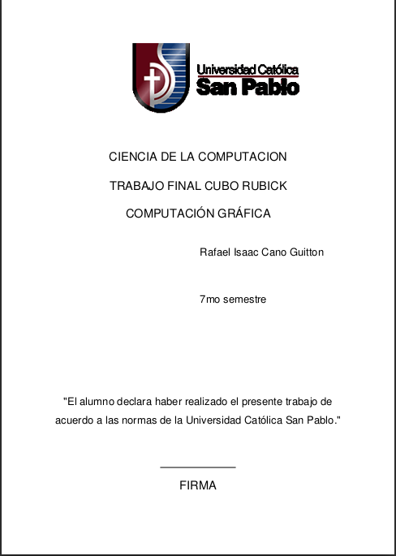

# Generador de carátulas UCSP - API

Generating covers for Uni work is tedious. So I made an API to do exactly that! This API will allow you to generate covers with certain parameters.

## How to use

The API can process two requests that does basically one thing. The process goes as follows:

- Make a POST HTTP call to this URL '/' with the following body structure.
  
  ```json
  {
      "carrera":"YOUR MAJOR HERE",
      "titulo":"YOUR WORK TITLE HERE",
      "curso":"YOUR COURSE HERE",
      "semestre":1-10 INT,
      "alumnos":["1ST STUDENT","2ND STUDENT",...]
  }
  ```

The request can be made in any order, simply follow these set of rules:

- `"semestre"` must receive an integer from 1-10

- `"alumnos"` must receive up to 6 names

Otherwise the API will give a `403 BAD REQUEST` response.

The aformentioned request will return a token like this `W2537V67` and you can use it to retrieve the cover at '/retornar_caratula/**token**'.

## Example


